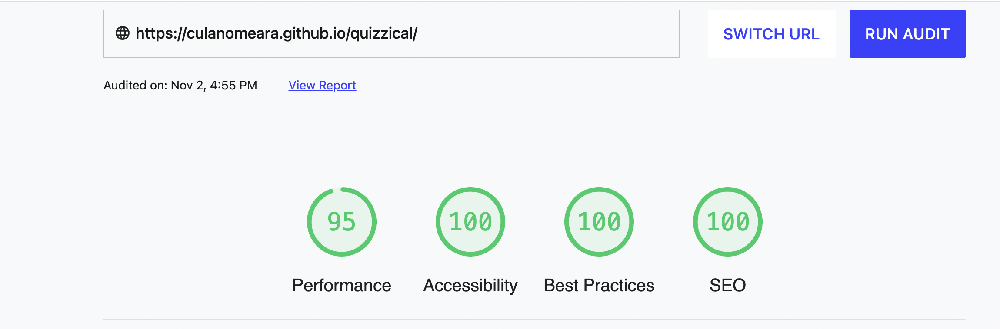

# Let's Get Quizzical

This site is aimed at Junior Cycle students looking to revise Mathematics topics. It gives students four topics to choose from. Each topic contains a set number of multiple choice questions and feedbackm is given after each question.

## Features 

- The site has a clear title that gives the user an instant sense of what the website is about: It's a Maths Quiz site.
- There are 3 pages:
  - Index page where user gets introduced to what the site is for and what they need to do
  - Quiz page where the user selects a topic and takes part in the quiz
  - End page where user receives a Report Card and can restart the quiz again.
- The user can reset the quiz at any time by clicking the RESET button.
- The page format ant styling is simple and uncluttered
- The font used is a IBM Plex Mono which I think works well with my Mathematical Quiz.
- Each topic has been chosen carefully. They are fundamental to the Junior Cycle Mathematics course.
- The user gets a Report Card when they have finished:
  - A summary of the number of correct anwers
  - A grade based on the number of correct answers
  - A colour that matches the Grade:
    - A = Green
    - B = Yellow
    - C = Orange
    - D = Pink
    - E = Red

------

------

## Testing 

- I have tested this site in various browsers:
  - Chrome(my main wokring browser)
  - [Safari](assets/images/safaritest.png)
  - [Firefox](assets/images/firefoxtest.png).

- I have tested the site to ensure that it is responsive and maintains it's structure and integrity with various screen sizes and devices other than my main working device(laptop):
  - [mobile](assets/images/mobiletest.jpg)
  - [tablet](assets/images/tablettest.jpg)
  - [desktop](assets/images/desktoptest.png)

- I have confirmed with users that the text is easy to read and the navigation menu easy to use.
- I have checked that the contact form works and ensured that required fields work as intended and that the form validates the input.

### Validator Testing 

- HTML
  - No errors were returned when passing through the official W3C Validator
    - [Index](https://validator.w3.org/nu/?doc=https%3A%2F%2Fculanomeara.github.io%2Fquizzical%2Findex.html)
    - [Quiz](https://validator.w3.org/nu/?doc=https%3A%2F%2Fculanomeara.github.io%2Fquizzical%2Fquiz.html)
    - [End](https://validator.w3.org/nu/?doc=https%3A%2F%2Fculanomeara.github.io%2Fquizzical%2Fend.html)
    
- CSS
  - No errors were found when passing through the official [(Jigsaw) validator](https://jigsaw.w3.org/css-validator/validator?uri=https%3A%2F%2Fculanomeara.github.io%2Fquizzical%2F&profile=css3svg&usermedium=all&warning=1&vextwarning=&lang=en)

### Fixed Bugs/Improvements

- I had a number of bugs that I worked thru:
  - Issue where question topic was not being passed to function correctly
  - Issue with changing topic and resetting all of the code to restart quiz.
  - Styling issues with certain areas where styling wasn't being applied inside.
  - Very long code sections were removed or tidied up with more efficeient code structure or function such as:
    - single displayQuestion function instead of different function for each topic.
    - using a let of function to read thru class array elements to carry out a task rather than all separate.
  - gave onclick function a unique name as it was being called repeatedly
  - 

## Deployment 
### Cloning and Forking
- To CLONE: 
  - Navigate to the repository: [Quizzical](https://github.com/culanomeara/quizzical)
  - Above the list of files, click Code.
  - Copy the URL for the repository.
  - Open Terminal and change to the new directory where you want the cloned files to go
  - type git clone and paste in the copied url from the repository

- To FORK:
  - Navigate to the repository: [Quizzical](https://github.com/culanomeara/quizzical)
  - At top of page, click on FORK
  - Select the owner, name and description for the new fork.
  - Select which branches you want to fork.
  - Create fork.

### Remote
- The site was deployed to GitHub pages. The steps to deploy are as follows: 
  - In the GitHub repository, click on the Settings icon 
  - On the left-hand menu, click on Pages
  - From the options that appear, select Deploy from branch, then select MAIN
  - Once you save those changes, the site goes live. It takes about 10 mins before you can see the live site.

The live link can be found here - https://culanomeara.github.io/quizzical/ 

## Credits 

### Content
- Text is all my own
- The font is IBM Plex Mono from Google Fonts [Google Fonts](https://fonts.google.com/specimen/IBM+Plex+Mono?query=IBM+Plex+Mono)
