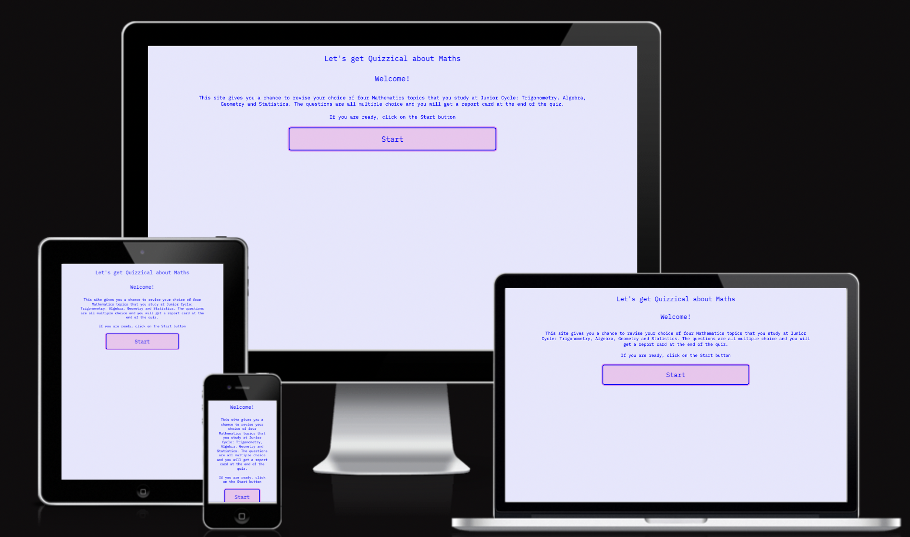

# Let's Get Quizzical

This site is aimed at Junior Cycle students looking to revise Mathematics topics. It gives students four topics to choose from. Each topic contains a set number of multiple choice questions and feedback is given after each question. Users then receive at Report Card when the quiz is complete.

## Deployed Website
By clicking [here](https://culanomeara.github.io/quizzical), you can access the final Quizzical deployed site hosted on GitHub Pages.

## Responsiveness
Below you can see a screenshot of the deployed site in the Am I Responsive tool which shows the responsiveness of the site to a number of viewports. 

## User Interface - User Experience
### **User Stories**
Below are the user stories that needed to be fulfilled for the project to be successful from the perspective of the user:
* To discover the Quizzical site and understand the purpose of it.
* To be able to move through the site with ease on the first visit.
* To see their progress as they move thru the quiz questions.
* To be provided with feedback on how they performed.
* To be able to play again.

### **User Interface**
- The User interface is intentionally clean and clutter-free. Inspiration was taken from sites such as Google Search
- A very light background colour was added to reduce the glare effect of an all-white background
- There is a simple navigation structure throughout with no navigation bar
- The user is given signals to which areas can be clicked through the use of the cursor pointer
- Unintentional actions are prevented through the use of features such as 'hidden' and 'disable click'

### **User Experience**
- The Font chosen was IBM Plex Mono which I found at Google Fonts. The font was a computational/mathematical style type that reflected the purpose of the site
- The colour palette chosen was soft blue and pink tones. This was to accentuate the simple, unsophisticated style of the site.
- The user can reset the quiz at any time by clicking the RESET button.
- There are 3 pages:
  - Index page where user gets introduced to what the site is for and what they need to do [Index](assets/images/index.png)
  - Quiz page where the user selects a topic [Topic Choice](assets/images/topicchoice.png) and takes part in the quiz [Quiz](assets/images/quizquestion.png)
  - End page where user receives a Report Card and can restart the quiz again.[Report Card](assets/images/reportcard.png)
- On the Report Card there is:
  - A summary of the number of correct answers
  - A grade based on the number of correct answers
  - A colour that matches the Grade:
    - A = Green
    - B = Yellow
    - C = Orange
    - D = Pink
    - E = Red

## Features 
- Simple, uncluttered style with basic colour palette [Quiz page](assets/images/quizpage.png)
- No imagery to avoid distractions, clutter.
- Minimal number of buttons, clickable areas. Intuitive for users. [Start button](assets/images/startbtn.png)
- Visual signals when user moves over a clickable area. Cursor pointer and transformed size and colour used here. [Button transform size and colour](assets/images/responsive.png)
- Each topic has been chosen carefully. They are fundamental to the Junior Cycle Mathematics course. [Topics](assets/images/topics.png)
- When user clicks on a correct answer, it goes green and a message below says WELL DONE! [Correct Answer](assets/images/correctresponse.png)
- When user clicks on a wrong answer, it goes red and a message below says Oops and informs them of what the correct answer was [Wrong Answer](assets/images/wrongresponse.png)

## Features Yet To Be Implemented
- Add more Questions and topics.
- Add the ability to select a quiz with randomly selected questions from across a number of topics.
- With the increased questions, an improved Report Card that has grades assigned to a range of scores.
- Ability to import your own set of questions.

## Technologies Used
- HTML
- CSS
- Javascript
- Python

## Testing

- I have tested this site in various browsers:
  - Chrome(my main working browser)
  - [Safari](assets/images/safaritest2.png)
  - [Firefox](assets/images/firefox.png).

- I have tested the site to ensure that it is responsive and maintains it's structure and integrity with various screen sizes and devices other than my main working device(laptop):
  - [mobile](assets/images/mobilequiz.jpg)
  - [tablet](assets/images/tablettest2.jpeg)
  - [desktop](assets/images/desktop.png)

- I have confirmed with users that the text is easy to read and the quiz is intuitive and logical to use.
- All code works as intended.
- There are no console errors visible.

### Validator Testing 

- HTML
  - No errors were returned when passing through the official W3C Validator
    - [Index](https://validator.w3.org/nu/?doc=https%3A%2F%2Fculanomeara.github.io%2Fquizzical%2Findex.html)
    - [Quiz](https://validator.w3.org/nu/?doc=https%3A%2F%2Fculanomeara.github.io%2Fquizzical%2Fquiz.html)
    - [End](https://validator.w3.org/nu/?doc=https%3A%2F%2Fculanomeara.github.io%2Fquizzical%2Fend.html)
    
- CSS
  - No errors were found when passing through the official [(Jigsaw) validator](https://jigsaw.w3.org/css-validator/validator?uri=https%3A%2F%2Fculanomeara.github.io%2Fquizzical%2F&profile=css3svg&usermedium=all&warning=1&vextwarning=&lang=en)

- JS
  - Put JS code through [JSHINT](https://jshint.com/) without error

### Fixed Bugs
- Issue where question topic was not being passed to function correctly
- Issue with changing topic and resetting all of the code to restart quiz.
- Styling issues with certain areas where styling wasn't being applied inside.
- Issue with safari and firefox browsers where outline border radius was not working. Changed setting to box-shadow and bug was fixed. [Browser bug](assets/images/outlinebug.png)

### Improvements
  - Very long code sections were removed or tidied up with more efficient code structure or function such as:
    - single displayQuestion function instead of different function for each topic.
    - using a let of function to read thru class array elements to carry out a task rather than all separate.
  - gave onclick function a unique name as it was being called repeatedly
  - I gave alot of time to coding the quiz to hide areas or prevent users from clicking other answers once they had chosen one. This ensures that the user experience is intuitive and streamlined.

## Deployment 
### Cloning, Forking and Local Deployment

- To CLONE: 
  - Navigate to the repository: [Quizzical](https://github.com/culanomeara/quizzical)
  - Above the list of files, click Code.
  - Copy the URL for the repository.
  - Open Terminal and change to the new directory where you want the cloned files to go
  - type git clone and paste in the copied url from the repository

- To FORK:
  - Navigate to the repository: [Quizzical](https://github.com/culanomeara/quizzical)
  - At top of page, click on FORK
  - Select the owner, name and description for the new fork.
  - Select which branches you want to fork.
  - Create fork.

- LOCAL:
  - Navigate to the repository: [Quizzical](https://github.com/culanomeara/quizzical)
  - On top menu bar, select Settings
  - On Side menu bar, select Pages
  - On the GitHub pages section, locate the dropdown that displays the word “None”. Click the dropdown and select the “Master” or “Main” branch.
  - The page will refresh automatically and provide a link to the deployed site. Click this link to load the deployed site. It may take a few minutes to appear.

### Content
- Text is all my own
- The font is IBM Plex Mono from Google Fonts [Google Fonts](https://fonts.google.com/specimen/IBM+Plex+Mono?query=IBM+Plex+Mono)